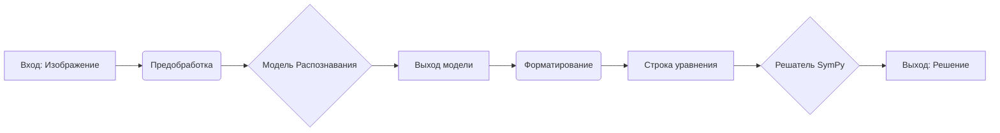

# Распознаватель и Решатель Рукописных Математических Уравнений

Краткое описание проекта: Этот проект представляет собой пайплайн, который принимает изображение рукописного математического уравнения, распознает его с помощью модели глубокого обучения (CNN/RNN) и решает с использованием библиотеки SymPy.

[](https://opensource.org/licenses/MIT)

<!-- (Опционально) Вставьте сюда GIF или скриншот работы приложения -->
<!--  -->

## Оглавление

*   [Мотивация](#мотивация)
*   [Технологический Стек](#технологический-стек)
*   [Архитектура](#архитектура)
*   [Структура Проекта](#структура-проекта)
*   [Установка](#установка)
*   [Использование](#использование)
    *   [Запуск предсказания](#запуск-предсказания)
    *   [Запуск веб-демо](#запуск-веб-демо)
*   [Обучение Модели](#обучение-модели)
*   [Результаты и Оценка](#результаты-и-оценка)
*   [Возможные Улучшения](#возможные-улучшения)
*   [Лицензия](#лицензия)
*   [Контакты](#контакты)

## Мотивация

Цель этого проекта - создать инструмент для автоматического распознавания и решения математических уравнений, написанных от руки. Это может быть полезно для студентов, инженеров и исследователей. Проект также служит демонстрацией навыков в области Computer Vision, Deep Learning и интеграции ML-моделей в практические приложения.

## Технологический Стек

*   **Python 3.x**
*   **TensorFlow / Keras** (или **PyTorch**) - для модели распознавания
*   **OpenCV** - для обработки изображений
*   **SymPy** - для символьного решения уравнений
*   **NumPy** - для численных операций
*   **Matplotlib** - для визуализации (в ноутбуках)
*   **Streamlit / Gradio** (опционально) - для веб-демо
*   **Jupyter Notebook** - для исследований

## Архитектура

Пайплайн состоит из следующих шагов:
1.  **Предобработка изображения:** Загрузка, изменение размера, бинаризация, удаление шума.
2.  **Распознавание:** Использование модели CNN (+ опционально RNN/Transformer) для идентификации символов и их порядка.
3.  **Постобработка/Форматирование:** Преобразование выхода модели в строку, понятную для решателя (например, `2*x+5=10`).
4.  **Решение:** Использование SymPy для нахождения решения уравнения.



## Структура Проекта

```
/math-equation-solver
│
├── .gitignore
├── LICENSE
├── README.md
├── requirements.txt
│
├── data/             # Скрипты загрузки/генерации данных
├── notebooks/        # Исследовательские ноутбуки
├── models/           # Сохраненные веса моделей
├── src/              # Исходный код
│   ├── recognition/    # Модуль распознавания
│   ├── preprocessing/  # Модуль предобработки
│   ├── solver/         # Модуль решателя
│   ├── postprocessing/ # Модуль форматирования
│   ├── pipeline.py     # Основной пайплайн
│   └── # app.py        # (Опц.) Веб-приложение
└── tests/            # Тесты
```

## Установка

1.  **Клонируйте репозиторий:**
    ```bash
    git clone https://github.com/ваш_username/math-equation-solver.git
    cd math-equation-solver
    ```

2.  **Создайте и активируйте виртуальное окружение (рекомендуется):**
    ```bash
    python -m venv .venv
    # Windows
    .\.venv\Scripts\activate
    # macOS/Linux
    source .venv/bin/activate
    ```

3.  **Установите зависимости:**
    ```bash
    pip install -r requirements.txt
    ```

4.  **Загрузите веса модели**:

## Использование

### Запуск предсказания для одного изображения

```bash
python src/pipeline.py --image_path /путь/к/вашему/изображению.png
```
Ожидаемый вывод:
```
Распознанное уравнение: 2*x + 5 = 10
Решение: {x: 5/2}
```

## Обучение Модели

1.  **Подготовка данных:**
    *   Запустите скрипты из директории `data/` для загрузки или генерации данных.
    *   `python data/download_crohme.py`
    *   `python data/generate_synthetic.py`
    *   Убедитесь, что данные находятся в ожидаемой структуре.

2.  **Запуск обучения:**
    ```bash
    python src/recognition/train.py --data_path /путь/к/данным --epochs 50 --batch_size 32
    ```
    *   Настройте параметры (эпохи, размер батча, learning rate и т.д.) в скрипте или через аргументы командной строки.
    *   Модель и логи обучения будут сохранены (пути настраиваются в `train.py`).

## Лицензия

Этот проект лицензирован под лицензией MIT - см. файл [LICENSE](LICENSE) для подробностей.
